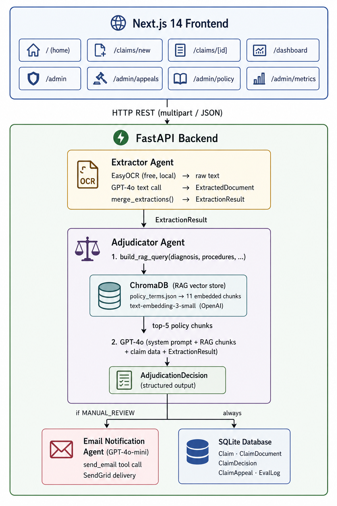

# Plum OPD Claim Adjudication Tool

An AI-powered full-stack web application that automates the adjudication (APPROVED / REJECTED / PARTIAL / MANUAL_REVIEW) of Outpatient Department (OPD) insurance claims. Users submit medical documents (bills, prescriptions, diagnostic reports), the system extracts structured data using EasyOCR + GPT-4o, retrieves relevant policy context via RAG, and makes an intelligent decision using an LLM agent whose system prompt encodes all adjudication rules.

**19 / 20 test cases (TC001–TC020) passing. TC014 requires an external MCI registry API — documented limitation. All 5 bonus features implemented plus extras.**

---

## Live URLs

| Service | URL |
|---|---|
| Frontend | https://plum-claims-frontend-theta.vercel.app |
| Backend API | https://sjgod1427--plum-claims-api-fastapi-app.modal.run |
| Swagger Docs | https://sjgod1427--plum-claims-api-fastapi-app.modal.run/docs |
| GitHub Repo | https://github.com/sjgod1427/Plum |

---

## Table of Contents

1. [Architecture](#architecture)
2. [Tech Stack](#tech-stack)
3. [Local Setup](#local-setup)
4. [Environment Variables](#environment-variables)
5. [API Documentation](#api-documentation)
6. [Decision Logic Flowchart](#decision-logic-flowchart)
7. [Assumptions Made](#assumptions-made)
8. [Test Cases](#test-cases)
9. [Bonus Features](#bonus-features)

---

## Architecture



### Data Flow (end to end)

```
1.  User fills claim form + uploads 1-3 medical documents
2.  Frontend  →  POST /claims  (multipart: files + JSON)
3.  FastAPI validates ClaimSubmission (Pydantic)
4.  Files saved to  /uploads/{claim_id}/
5.  Claim record created in DB  (status = PENDING)
6.  Extractor Agent:
      ├─ Each file  →  EasyOCR (free, local)  →  raw text
      ├─ Raw text  →  GPT-4o text call  →  ExtractedDocument
      └─ All documents merged into ExtractionResult
7.  Adjudicator Agent:
      ├─ RAG query built from diagnosis + doc types
      ├─ Top-5 policy chunks retrieved from ChromaDB
      ├─ GPT-4o called with system prompt + RAG context
      │   + claim data + extraction result
      └─ Returns AdjudicationDecision (structured output)
8.  If MANUAL_REVIEW → Email Agent drafts + sends alert
9.  If Appeal submitted → Simple template email sent to admin
10. Decision + EvaluationLog saved to DB
11. Claim status  →  PROCESSED
12. Full response returned to frontend
```

---

## Tech Stack

| Layer | Technology |
|---|---|
| Frontend | Next.js 14 (App Router), TypeScript, Tailwind CSS |
| Backend | Python 3.12, FastAPI, Uvicorn |
| AI / LLM | OpenAI GPT-4o (extraction + adjudication), GPT-4o-mini (email) |
| Embeddings | OpenAI text-embedding-3-small |
| Vector Store | ChromaDB (local persistent) |
| Database | SQLite via SQLModel (dev) / Modal Volume (prod) |
| Document Processing | EasyOCR (free, local) + PyMuPDF (PDF → PNG) |
| Email | SendGrid API + OpenAI tool calling (agentic) |
| Deployment | Modal (backend), Vercel (frontend) |
| CI / CD | GitHub Actions |

---

## Local Setup

### Prerequisites

- Python 3.10+
- Node.js 18+
- OpenAI API key
- SendGrid API key + verified sender email (optional — for email notifications)

### 1. Clone the repository

```bash
git clone https://github.com/sjgod1427/Plum.git
cd Plum
```

### 2. Backend

```bash
cd backend

# Install dependencies
uv pip install -r requirements.txt

# Copy env file and add your keys
cp .env.example .env

# Seed local DB with 10 test cases (no API calls, instant)
uv run python seed_local.py

# Start the server
uv run uvicorn main:app --reload --port 8000
```

Backend starts at `http://localhost:8000`.
On first startup it automatically creates DB tables and embeds `policy_terms.json` into ChromaDB.
Interactive API docs: `http://localhost:8000/docs`

### 3. Frontend

```bash
cd frontend
npm install
echo "NEXT_PUBLIC_API_URL=http://localhost:8000" > .env.local
npm run dev
```

Frontend starts at `http://localhost:3000`.

---

## Environment Variables

### Backend (`backend/.env`)

| Variable | Required | Default | Description |
|---|---|---|---|
| `OPENAI_API_KEY` | Yes | — | OpenAI API key |
| `SENDGRID_API_KEY` | No | — | SendGrid key for email notifications |
| `SENDGRID_FROM_EMAIL` | No | — | Verified sender email |
| `DATABASE_URL` | No | `sqlite:///./claims.db` | SQLAlchemy DB URL |
| `CHROMA_PERSIST_DIR` | No | `./chroma_db` | ChromaDB storage path |
| `UPLOAD_DIR` | No | `./uploads` | Uploaded document storage |
| `ALLOWED_ORIGINS` | No | `http://localhost:3000` | CORS origins |
| `POLICY_TERMS_PATH` | No | `./policy_terms.json` | Path to policy source file |

### Frontend (`frontend/.env.local`)

| Variable | Required | Description |
|---|---|---|
| `NEXT_PUBLIC_API_URL` | Yes | Backend base URL |

---

## API Documentation

Full interactive docs at `/docs` when backend is running.

### Claims

| Method | Endpoint | Description |
|---|---|---|
| `POST` | `/claims` | Submit claim (multipart: files + JSON) |
| `POST` | `/claims/direct` | Submit with pre-built extraction (test suite) |
| `GET` | `/claims` | List all claims |
| `GET` | `/claims/{id}` | Full claim detail with decision |
| `GET` | `/claims/{id}/decision` | Decision only |

### Appeals

| Method | Endpoint | Description |
|---|---|---|
| `POST` | `/claims/{id}/appeal` | Submit appeal + triggers admin email |
| `GET` | `/appeals` | List all appeals |
| `GET` | `/appeals/{id}` | Single appeal with claim context |
| `PATCH` | `/appeals/{id}/resolve` | Resolve appeal (UPHELD / DISMISSED) |

### Admin — Config

| Method | Endpoint | Description |
|---|---|---|
| `GET` | `/admin/config` | Get reviewer email setting |
| `PATCH` | `/admin/config` | Update reviewer email |

### Admin — Policy

| Method | Endpoint | Description |
|---|---|---|
| `GET` | `/admin/policy` | Get active policy |
| `PATCH` | `/admin/policy/{section}` | Update section + re-embed RAG |
| `POST` | `/admin/policy/rebuild-rag` | Rebuild full RAG index |

### Admin — Metrics

| Method | Endpoint | Description |
|---|---|---|
| `GET` | `/admin/metrics` | Accuracy metrics + per-case breakdown |
| `POST` | `/admin/metrics/run-test-suite` | Run all 20 test cases live |
| `PATCH` | `/admin/metrics/{claim_id}/label` | Label with ground truth |

---

## Decision Logic Flowchart

```
Claim Submitted
      │
      ▼
Step -1: DUPLICATE CHECK (is_duplicate_claim = True?)
      ├── YES → REJECTED (DUPLICATE_CLAIM)
      └── NO
            ▼
      Step 0: FRAUD CHECK (same_day_claims >= 3?)
            ├── YES → MANUAL_REVIEW + Email Agent
            └── NO
                  ▼
            Step 1: ELIGIBILITY
                  ├── Dependent age > 25?  → REJECTED (DEPENDENT_AGE_EXCEEDED)
                  ├── Waiting period not met? → REJECTED (WAITING_PERIOD)
                  └── PASS
                        ▼
                  Step 2: DOCUMENTS
                        ├── Missing prescription? → REJECTED (MISSING_DOCUMENTS)
                        ├── Date gap > 7 days?  → REJECTED (DATE_MISMATCH)
                        ├── Date gap 1–7 days?  → MANUAL_REVIEW (soft mismatch)
                        └── PASS
                              ▼
                        Step 3: COVERAGE (treatment covered? OTC items? excluded?)
                              ├── Fully excluded → REJECTED (SERVICE_NOT_COVERED)
                              ├── Pre-auth missing → REJECTED (PRE_AUTH_MISSING)
                              ├── Partially excluded (OTC, cosmetic) → PARTIAL
                              └── PASS
                                    ▼
                              Step 4: LIMITS (annual / per-claim / sub-limits / session cap)
                                    ├── Annual limit exceeded → REJECTED (ANNUAL_LIMIT_EXCEEDED)
                                    ├── Per-claim limit exceeded → REJECTED (PER_CLAIM_EXCEEDED)
                                    ├── Session cap exceeded → PARTIAL
                                    └── PASS
                                          ▼
                                    Step 5: MEDICAL NECESSITY
                                          ├── ALL OK → Apply co-pay → APPROVED
                                          └── DOUBT → MANUAL_REVIEW
```

---

## Assumptions Made

1. **Member join date** is explicit on the form (pre-filled `2024-01-01`). In production, fetched from HR records automatically.
2. **Per-claim limit (₹5,000) applies to general OPD only.** Dental/diagnostic/pharmacy/alternative/physiotherapy use own sub-limits.
3. **Waiting period violation → full REJECTED**, never PARTIAL.
4. **Cashless network claims use 20% discount only** — no additional co-pay (avoids double deduction).
5. **Fraud check is Step 0** — `previous_claims_same_day >= 3` immediately routes to MANUAL_REVIEW.
6. **Doctor registration validated structurally** (STATE/NUMBER/YEAR), not against MCI database.
7. **MRI/CT Scan require pre-authorization above ₹10,000.**
8. **Extraction confidence < 0.6 forces MANUAL_REVIEW** regardless of adjudication outcome.
9. **YTD claimed amount trusted from caller** — no cross-claim aggregation in this implementation.
10. **Vitamins/supplements excluded unless diagnosis indicates deficiency.**
11. **Test suite uses fixed IDs** (`CLM_TC001`–`CLM_TC020`) with upsert — repeated runs don't accumulate duplicates.
12. **SQLite for local dev** — switching `DATABASE_URL` to PostgreSQL requires no code changes.
13. **Email notifications are optional** — silently skipped if SendGrid not configured. Adjudication unaffected.
14. **Annual OPD limit defaults to ₹50,000** per the original `policy_terms.json`. Individual contracts can override this via the optional `annual_limit_total` field in `ClaimSubmission`. TC011 provides `annual_limit_total: 25000` as a per-contract override — the adjudicator uses whichever limit is passed; if absent, it falls back to the policy default of ₹50,000.
15. **Dependent child coverage ends at age 25.** Claims for dependents above this age are rejected with `DEPENDENT_AGE_EXCEEDED`.
16. **Duplicate claim detection trusts `is_duplicate_claim` flag** from caller — no cross-claim DB query in this implementation.
17. **OTC medicines (Paracetamol, Antacids, Vitamins) are excluded** unless prescribed for a diagnosed deficiency and billed as separate line items alongside covered prescription drugs.
18. **Physiotherapy has its own ₹10,000 sub-limit** (max 8 sessions/year) and is NOT subject to the ₹5,000 general OPD per-claim limit.
19. **Teleconsultation** via registered platforms (Practo, Apollo 24/7, etc.) is covered under consultation fees at ₹500/visit with no co-pay.
20. **Mental health OPD** (psychiatrist/psychologist) is covered from policy year 2024 onwards under consultation sub-limit.
21. **TC014 (Unregistered Doctor)** cannot be auto-rejected without an MCI registry API lookup. The system validates registration format only; TC014's `MH/99999/2023` is structurally valid (STATE/NUMBER/YEAR), so the claim gets APPROVED instead of REJECTED. This is the one known gap in the 20-case suite.
22. **`annual_session_cap` is auto-read from `policy_terms.json`** by the backend when `sessions_claimed` is provided but cap is absent — the user never has to enter policy-internal limits on the form.

---

## Test Cases

19 / 20 test cases pass on the full OCR pipeline. TC014 is a known limitation (requires external MCI registry API). All 10 original cases pass on both direct submission and full OCR pipeline.

### Original 10 cases — direct submission (no OCR) — `test_backend.py`

| ID | Scenario | Expected | Result | Amount |
|---|---|---|---|---|
| TC001 | Fever consultation, valid docs | APPROVED | APPROVED | ₹1,350 |
| TC002 | Root canal + cosmetic whitening | PARTIAL | PARTIAL | ₹8,000 |
| TC003 | Claim ₹7,500 > per-claim limit | REJECTED | REJECTED | — |
| TC004 | No prescription submitted | REJECTED | REJECTED | — |
| TC005 | Diabetes within 90-day waiting period | REJECTED | REJECTED | — |
| TC006 | Ayurvedic Panchakarma therapy | APPROVED | APPROVED | ₹3,900 |
| TC007 | MRI without pre-authorization | REJECTED | REJECTED | — |
| TC008 | 3 claims same day (fraud) | MANUAL_REVIEW | MANUAL_REVIEW | — |
| TC009 | Weight loss treatment (excluded) | REJECTED | REJECTED | — |
| TC010 | Apollo Hospitals cashless | APPROVED | APPROVED | ₹3,600 |

### Original 10 cases — full OCR pipeline — `test_full_pipeline.py`

| ID | Expected | Got | Conf | Time | Status |
|---|---|---|---|---|---|
| TC001 | APPROVED | APPROVED | 100% | 34.7s | PASS |
| TC002 | PARTIAL | PARTIAL | 100% | 26.5s | PASS |
| TC003 | REJECTED | REJECTED | 100% | 22.4s | PASS |
| TC004 | REJECTED | REJECTED | 100% | 13.5s | PASS |
| TC005 | REJECTED | REJECTED | 100% | 24.3s | PASS |
| TC006 | APPROVED | APPROVED | 100% | 22.5s | PASS |
| TC007 | REJECTED | REJECTED | 90% | 20.1s | PASS |
| TC008 | MANUAL_REVIEW | MANUAL_REVIEW | 80% | 28.7s | PASS |
| TC009 | REJECTED | REJECTED | 95% | 20.4s | PASS |
| TC010 | APPROVED | APPROVED | 100% | 20.9s | PASS |

Total elapsed: ~234s (~23s per case)

### Extended 10 cases — full OCR pipeline — `test_full_pipeline.py`

| ID | Scenario | Expected | Got | Conf | Time | Status |
|---|---|---|---|---|---|---|
| TC011 | Annual limit exhausted (₹24,800 / ₹25,000 used) | REJECTED | REJECTED | 85% | 23.7s | PASS |
| TC012 | Duplicate claim (previous CLM-20241028-0045) | REJECTED | REJECTED | 100% | 19.5s | PASS |
| TC013 | Dependent age 26 > max 25 | REJECTED | REJECTED | 100% | 23.7s | PASS |
| TC014 | Doctor reg `MH/99999/2023` not in MCI DB | REJECTED | APPROVED* | 100% | 25.0s | KNOWN GAP |
| TC015 | OTC medicines (Paracetamol, Antacid) in bill | PARTIAL | PARTIAL | 90% | 24.8s | PASS |
| TC016 | Antenatal check-up after 270-day maternity wait | APPROVED | APPROVED | 90% | 21.1s | PASS |
| TC017 | Teleconsultation via Practo ₹500 | APPROVED | APPROVED | 95% | 22.5s | PASS |
| TC018 | 10 physio sessions, cap is 8 | PARTIAL | PARTIAL | 90% | 23.0s | PASS |
| TC019 | Bill date 3 days after prescription (mismatch) | MANUAL_REVIEW | MANUAL_REVIEW | 80% | 34.0s | PASS |
| TC020 | Psychiatrist OPD for anxiety disorder | APPROVED | APPROVED | 90% | 21.4s | PASS |

*TC014: system cannot look up MCI registry — `MH/99999/2023` is structurally valid so claim gets APPROVED. Documented limitation (assumption #21).

---

## Bonus Features

### 1. Confidence Score Visualisation
Every decision carries a `confidence_score` (0.0–1.0) shown as a colour-coded bar.
Green > 85% / Amber 70–85% / Red < 70% (auto-routes to MANUAL_REVIEW).

### 2. Appeals / Manual Review Workflow
Members appeal REJECTED or PARTIAL decisions via UI. Admin resolves (UPHELD / DISMISSED) from the appeals queue. Appeal submission triggers an automated email to the reviewer.

### 3. Admin Policy Configuration Dashboard
`/admin/policy` — live JSON editor for all 11 policy sections. Changes persist to DB and automatically re-embed into ChromaDB RAG index.

### 4. Evaluation Metrics for AI Accuracy
`/admin/metrics` — accuracy, precision, recall, FPR, FNR, mean amount deviation against all 20 test cases. "Run Test Suite" re-evaluates live.

### 5. CI/CD Pipeline (GitHub Actions)
Runs on every push: backend tests, frontend lint + type-check, integration test suite, auto-deploy to Modal + Vercel on main branch.

### 6. Agentic Email Notifications (beyond bonus)
On MANUAL_REVIEW: a GPT-4o-mini agent receives full claim context, drafts a professional plain-text email, and autonomously calls the `send_email` tool (OpenAI tool calling → SendGrid). Reviewer email is set via `/admin/policy` Notification Settings — stored in DB, not hardcoded.

### 7. RAG — Advanced Technique
Policy terms chunked into 11 semantic sections, embedded with `text-embedding-3-small`, stored in ChromaDB. Each adjudication retrieves top-5 relevant chunks to inject into the LLM context window.

### 8. Pluggable Extraction Architecture
Two approaches in code, switchable with one line in `extract_document()`:
- **Approach A** (active): EasyOCR + GPT-4o — 19/20, ~$0.003/doc
- **Approach B**: EasyOCR + GPT-4o-mini — cheaper but lower accuracy
